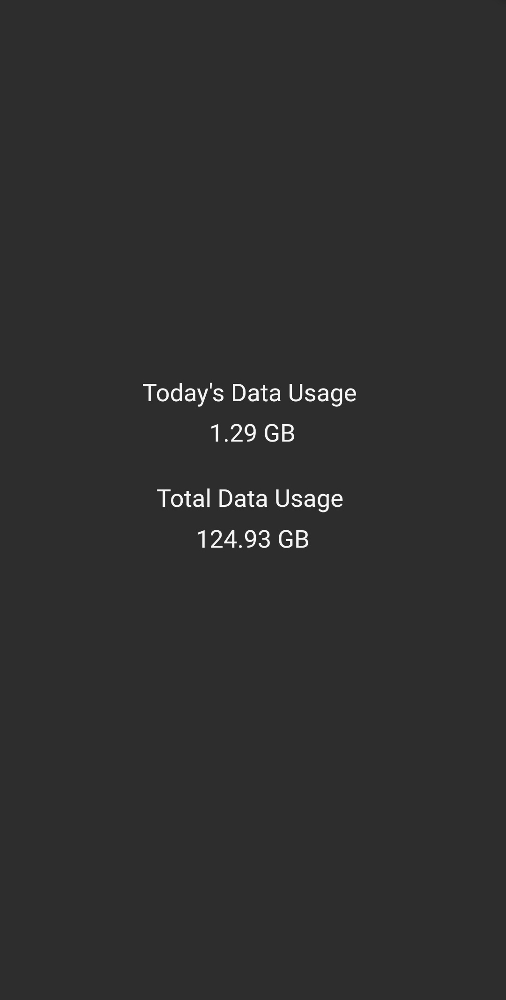

 

# DT 
### DataTracker  
A simple one-page flutter app to tell me how much data is left with my BSNL FTTH Connection.
No Login Required.

### Why 
So, that data can be used judiciously by us. (hopefully) 

### Working
- Send a GET request to BSNL FUP(Fair Usage Policy) URL and parse the response headers to acquire cookie. 
- Use the cookie to send a Post request to BSNL's fetch_user_quota end-point. This end-point gives back JSON with the required fields.

### URLs Involved
- http://172.30.139.25:9090/ssssportal1/fetchUserQuotaPM.do
- http://172.30.139.25:9090/ssssportal1/manualRedirection.do

### Images
<centre>

<centre>

> Note: These URLs are region-dependent. You might need to change it, depending upon yours.